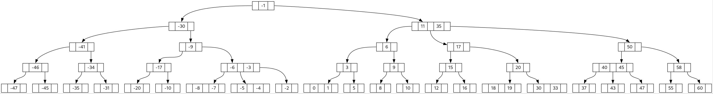
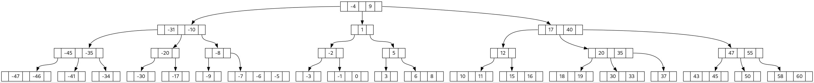
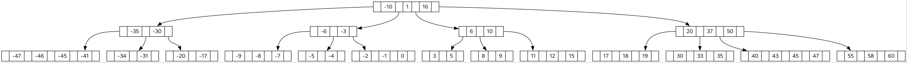
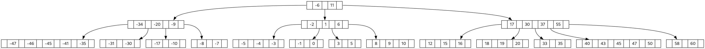
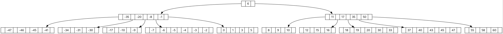
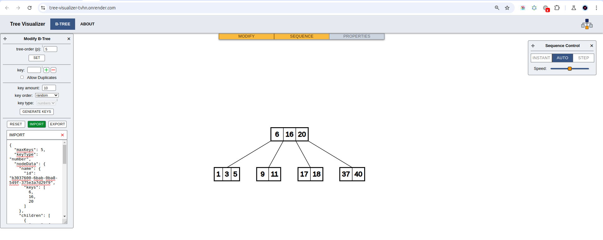

# PHP B-Tree
A simple and ready-to-use project which is able to create `B-Tree` representation (`images and B-Tree Data Structure dump`) from a set of number given.

By ``set of number`` of numbers imply ``unique numbers only``.

### Table of content:
- [overview](#overview)
- [installation and dependencies](#installation)
- [demo: built-in B-Tree visual representation](#built-in-b-tree-visual-representation)
- [demo: dump the B-Tree and see a visual representation using external sources **[external sources are provided]**](#dump-the-b-tree-data-structure-and-see-a-visual-representation-of-it-using-external-sources)
- [how to use and how to specify your own number set](#how-to-use-how-to-start)
- [usage console command](#usage-console-command)
- [PHP version](#php-version)
- [helpful sources](#helpful-sources)

## Overview
#### The main goals are to create a B-Tree project with is:
- is able to build visual representation of the B-Tree [**means, an image**]
- is able to dump B-Tree Data Structure to see the structure with help of external source
- is in OOP-like style
- is finished and ready-to-use project, not a lib

#### For whom
- learners/students
- anyone interested in this topic

## Installation
```bash
 clone this repository
```
It also requires the **graphviz** which is a tool designed to help create a B-Tree image. It is free to use lib.

Without **graphviz** the following error will occur:

```shell
sh: dot: not found
```

install the **graphviz** library:

for **docker** (run it inside container or add to the Dockerfile)
 ```bash
 apk add graphviz
```

for **linux** and **debian**
 ```bash
sudo apt install graphviz
```
or visit official [site](https://graphviz.org/download/)

run **composer** install and dump command

```bash
composer install && composer dump-autoload -o
```

## Built-in B-Tree visual representation
Examples of visual representation of B-trees that are built by the ``php/b-tree`` for various **capacities** given:

**capacity of 3**


**capacity of 4**


**capacity of 5**


**capacity of 6**


**capacity of 7**


You can see more examples here: ````media/graph/examples````

## Dump the B-Tree Data Structure and see a visual representation of it using external sources

This is an example of a B-Tree dump for capacity of 5:
```json lines
{
  "maxKeys": 5,
  "keyType": "number",
  "nodeData": {
    "name": {
      "id": "b3037600-6bab-0ba8-549f-375e3a7d29f9",
      "keys": [
        6,
        16,
        20
      ]
    },
    "children": [
      {
        "name": {
          "id": "da561c35-88a9-697a-8492-587a422b89b0",
          "keys": [
            1,
            3,
            5
          ]
        }
      },
      {
        "name": {
          "id": "79121886-5ada-d62a-7cd9-6ad2606b6f14",
          "keys": [
            9,
            11
          ]
        }
      },
      {
        "name": {
          "id": "264f2d4a-9d2d-f620-c501-b244cc8334ea",
          "keys": [
            17,
            18
          ]
        }
      },
      {
        "name": {
          "id": "fbe3a3e4-8a34-067d-d751-f7fb162093da",
          "keys": [
            37,
            40
          ]
        }
      }
    ]
  }
}
```
#### Visual representation using external sources

To see what a B-Tree dump looks like, **import** the dump here: [CLICK ME](https://tree-visualizer-tvhn.onrender.com/)
> **IMPORTANT:**
> to build a visual representation of the B-Tree, you need to adjust the **tree-order(p)** which is the **capacity**, actually.
> The **tree-order(p)** **should be the same** as the **capacity**  for the **dump**, and you can set it up by click on **Modify** tab
> on the site mentioned above

*Visual representation of the dump above with capacity of 5 **(tree-order(p))***


You can see more test dumps here: ````media/dump/examples```` folder.

## How to use? How to start?

> **Note:**
> you need to run CLI command from the root folder for ``bin`` one
 
The project itself does not have an interface/frontend yet, and to get a B-Tree dump or a B-Tree image you need to run 
B-Tree Builder with the following CLI command:

```console
supa_mega@user:$ bin/console -t btree -c 3 -s "1, 2, 3, 4, 5, 6" -g -d
```
#### where:
- ``-t`` type of structure. This one is required one. Currently only ``btree`` is available
- ``-c`` is ``capacity``. Optional one. Default ``capacity`` is 3. You can specify any value of the capacity. The capacity ``always`` must be equal or greater then 3 [capacity >= 3]
- ``-s`` is ``number set`` to use to build a tree. Optional one. ``"1, 2, 3, 4, 5, 6"`` these are the numbers that need to be used, and they should always be comma-separated and quoted
- ``-g`` is a flag to create an image of the B-Tree for the set of numbers provided by ``-s`` or by ``-f`` (see below) flags. If ``-g`` is not provided, the image will not be created
- ``-d`` is a flag to create a dump. If ``-d`` is not provided, the dump will not be created.

> **Note**
> If ``-s`` and ``-f`` (see below) flags are not provided, then just a range of numbers from -100 to 100 will be used
 
The dump [``-d``] will be located here: ``media/dump`` folder.

The image [``-g``] will be located here: ``media/graph`` folder.

> **Note:**
> Any combination of flags you specify in the CLI will not create an image or dump without these ``-g`` and ``-d`` flags.
> The B-Tree structure itself will be built and the CLI will finish successfully, but there will be no visual representation or dump.
> So, just specify the flag if you need visual representation ot the dump

How to use dump has been described [here](#dump-the-b-tree-data-structure-and-see-a-visual-representation-of-it-using-external-sources)


### Use a file containing a set of numbers instead of passing a set of numbers through the CLI command

```console
supa_mega@user:$ bin/console -t btree -c 3 -f num_set_exmpl.json -g -d
```
#### where:
- ``-f`` is a file name flag and ``num_set_exmpl.json`` is a file to use which

The ``num_set_exmpl.json`` is an example. You can create and name it as you want.

> **Note:**
> the file must be located under ``media/number-sets`` folder

Check existing one as an example: ``media/number-sets/num_set_exmpl.json``

> **Note:**
> the number set file should always be a ``JSON`` file containing ``only one`` set. 
> Check the example mentioned above


## Usage console command

To see more details just run the following CLI command:

```console
supa_mega@user:$ bin/console
usage:
                 -t      a mandatory argument indicates the type of the CLI Command Processor it needs to run ["btree" is currently only available] 
                 -c      an optional argument to define the capacity of the node. THE CAPACITY MUST BE >= 3 [default capacity will be used otherwise: 3]
                 -s      an optional argument to embed int set, e.g. -s "1,2,3,4" [if not specified AND no file specified [-f], the default range will be used -100 to 100]
                 -d      an optional argument when used of which the B-Tree`s node structure will be dump in json format. It will be placed in [media/dump] folder. This folder contains examples as well
                 -g      an optional argument using which the script will draw the B-Tree structure in the picture. It will be placed in [media/graph] folder. This folder contains examples as well 
                 -f      an optional argument indicates the filename it needs to use to load the number set
                         if [-f] not specified AND no set [-s] specified, the default range will be used -100 to 100    
                         the file should be located under [media/number-set] folder (check example: num_set_exmpl.json)         
Examples:
                 1. bin/console -t btree -c 3 -f num_set_exmpl.json -g -d

                 this command will start the [btree] processor which will use the [-f] file 'num_set_exmpl.json' to build a b-tree with a capacity [-c] of '3'. 
                 It will also create a b-tree dump [-d] in the 'media/dump' folder and a b-tree image [-g] in the 'media/graph' folder 

                 bin/console -t btree -c 3 -s "1, 2, 3, 6, 9, 4" -g -d

                 this command will do exactly the same thing but uses the given set [-s] instead of the file [-f]
```

## PHP version

Requires PHP 8.3 or higher

## Helpful sources
A site that will help you build your own B-Tree: [CLICK ME](https://www.cs.usfca.edu/~galles/visualization/BTree.html)

An [article](https://blog.jcole.us/2013/01/10/btree-index-structures-in-innodb/) explaining technical moments of the *B+Tree*

An [online DOT editor](https://dreampuf.github.io/GraphvizOnline/#digraph%20G%20%7B%0A%0A%20%20subgraph%20cluster_0%20%7B%0A%20%20%20%20style%3Dfilled%3B%0A%20%20%20%20color%3Dlightgrey%3B%0A%20%20%20%20node%20%5Bstyle%3Dfilled%2Ccolor%3Dwhite%5D%3B%0A%20%20%20%20a0%20-%3E%20a1%20-%3E%20a2%20-%3E%20a3%3B%0A%20%20%20%20label%20%3D%20%22process%20%231%22%3B%0A%20%20%7D%0A%0A%20%20subgraph%20cluster_1%20%7B%0A%20%20%20%20node%20%5Bstyle%3Dfilled%5D%3B%0A%20%20%20%20b0%20-%3E%20b1%20-%3E%20b2%20-%3E%20b3%3B%0A%20%20%20%20label%20%3D%20%22process%20%232%22%3B%0A%20%20%20%20color%3Dblue%0A%20%20%7D%0A%20%20start%20-%3E%20a0%3B%0A%20%20start%20-%3E%20b0%3B%0A%20%20a1%20-%3E%20b3%3B%0A%20%20b2%20-%3E%20a3%3B%0A%20%20a3%20-%3E%20a0%3B%0A%20%20a3%20-%3E%20end%3B%0A%20%20b3%20-%3E%20end%3B%0A%0A%20%20start%20%5Bshape%3DMdiamond%5D%3B%0A%20%20end%20%5Bshape%3DMsquare%5D%3B%0A%7D) to help to build any graphs


